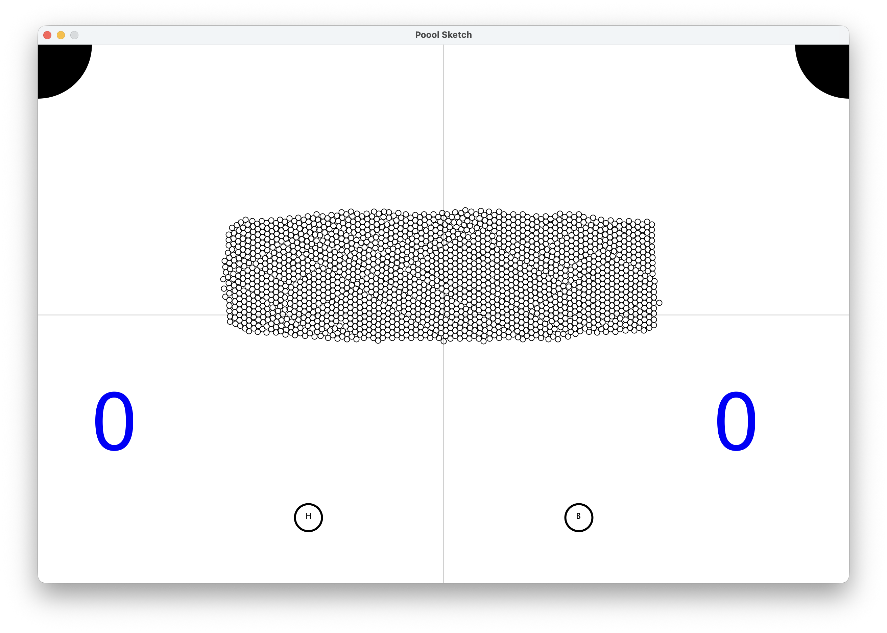

PCD a.y. 2025-2026 - ISI LM UNIBO - Cesena Campus

# Assignment #01 -  Poool Game

v1.0.1-20260401

The assignment is about designing and developing a game called `Poool`. 

### Game Description 

The game consists in a bidimensional board with a number of small balls and two bigger balls, representing a human player ball and a bot (i.e. computer controlled) ball.  



The number of small balls can be high (thousands). All balls can move and bounce,  against the border or each other. We consider elastic collisions and friction force, so that a moving ball stops after a while.  At the top of the board, in the corners, there are two circles representing holes. The objective of the game for the players (human and bot) is to kick the small balls in the holes, by throwing their own balls in a sequence of throws. 

Details:
- When a player puts a small ball in a hole, his/her score is incremented by one
- If a small ball kicks another small balls in a hole, scores are not changed
- The game ends when there are no more balls in the board and the winner is the player with the biggest score 
- The game ends also if/when the ball of a player goes in a hole. In that case, the winner is the other player, in spite of the score.
- To kick her/his ball, the human player can press keys - UP, DOWN, LEFT, RIGHT - to instantaneously update the velocity (simulating an impulse)
  - for instance, by pressing UP the velocity vector can be updated by adding the vector (0,1)
- Players (human and bot) play asynchronously
- The score of the human and bot player is displayed somewhere: in the picture: in blue, on the left (human) and on the right (bot)

### The Assignment

Design and develop a concurrent version of `Poool`, in two different versions:
1)  One based on Java **multithreaded programming**, using only default/platform threads;
2)  A variant applying **Task-based** approach, using Java **Executor Framework**, where useful.


The concurrent programs should be designed according the principles studied during the course, promoting modularity, encapsulation as well as performance, reactivity. Further remarks:
- For enabling/managing interaction among active components/threads, high-level constructs such as monitors should be preferably used (vs. low-level mechanisms) when possible, providing your own implementation.
- The behaviour of the bot is not meant to be smart, could be any.
- For every other aspect not specified, students are free to choose the best approach for them.

Beside the source code, the assignment should contain a brief report, including:
- A brief analsysis of the problem, focusing in particular those aspects that are relevant from a concurrent point of view
- A brief description of the adopted design, the architecture (structure) and the behaviour
  - for the behaviour, one or multiple Petri Nets can be used, choosing the proper level of abstraction
- Performance tests to check and discuss: 
  - how much the concurrent version is better than a sequential one
  - how much the program is effective in exploiting available cores
- Verification of the program (or some parts of it), using model-checking and JPF in particular 

The `assignment-01`folder in the repo includes two sketches that could be used as a starting point
- [`sketch01`](./sketch-01.md) is an example of main loop using a sequential approach to implement the dynamics of the bouncing balls, as requested in the game
- [`sketch02`](./sketch-02.md) is an example of a GUI program with asynchronous input from the keyboard, architected using MVC

### Build and Tests

Assignment 1 uses Maven with Java 17. Run the full build locally with:

```bash
mvn -f assignment-1/pom.xml clean verify
```

Specific JUnit 5 tests can be added under `assignment-1/src/test/java` and run with:

```bash
mvn -f assignment-1/pom.xml -Dtest=ClassName test
```

The sequential physics engine can also be benchmarked independently after
compilation:

```bash
mvn -f assignment-1/pom.xml test
java -cp assignment-1/target/classes pcd.poool.benchmark.PhysicsBenchmark 600
```

The playable sequential baseline uses the physics engine as its computational
core. It runs in one thread but models the two players independently: the human
and the bot can each kick their own cue ball whenever that specific ball is
stopped, without enforced turn alternation. It can be launched with:

```bash
mvn -f assignment-1/pom.xml test
java -cp assignment-1/target/classes pcd.poool.SequentialPoool
```

The human player can press, drag, and release the mouse on the board to kick the
blue cue ball toward the release point when the human ball is available. The
visible shot vector previews direction and power; longer drags produce
stronger shots up to a capped impulse. The solid segment shows the selected
impulse, while the dashed continuation previews the shot direction. Arrow keys
are also supported, including quick diagonal combinations such as UP+RIGHT. The
red bot ball is controlled by a simple deterministic sequential strategy and
shows the same preview vector shortly before shooting. The HUD shows the
remaining small balls, frame rate, score, player readiness, and average physics step
time. When the game ends, a full-screen overlay shows the winner and final
score; press R to start a new game. A baseline metric for the integrated
sequential game loop can be collected with:

```bash
java -cp assignment-1/target/classes pcd.poool.benchmark.SequentialGameBenchmark 600
```

The first platform-thread implementation is available through the reusable
`pcd.poool.threaded.ThreadedGameRunner`. It keeps the sequential game model as
the reference semantics, owns it from a controller platform thread, accepts
asynchronous shot commands through a monitor, publishes immutable snapshots,
and can optionally start a separate bot platform thread. Focused tests cover
controller progression, asynchronous command execution, bot activity, and
shutdown behavior.

The playable platform-thread launcher can be started with:

```bash
java -cp assignment-1/target/classes pcd.poool.ThreadedPoool
```

The GitHub Actions workflow `Assignment 1 Maven CI` runs the Maven build on assignment-1 changes and also supports a manual `test_selector` input for targeted test runs.

Additional architectural notes, including the feasibility assessment for the
platform-thread implementation and the proposed spatial decomposition strategy,
are available in [`docs/concurrent-architecture.md`](docs/concurrent-architecture.md).

The GitHub Actions workflow `Assignment 1 Delivery Package` runs on pushes to
`main` and can also be started manually. It builds the report PDF and uploads an
`Assignment-01.zip` artifact with the delivery structure required below. On
`main`, it also publishes the same zip as a GitHub Release asset under the
shared `assignments-latest` tag. The release is deleted and recreated on each
successful `main` build, so it always contains the latest generated delivery
assets. The package includes the assignment project files needed to build and
inspect the solution, excluding internal documentation, the LaTeX report source
directory, and build outputs.


### The deliverable

The deliverable must be a zipped folder `Assignment-01`, to be submitted on the course web site, including:  
- `src` directory with sources
- `doc` directory with the report in PDF (`report.pdf`). 


