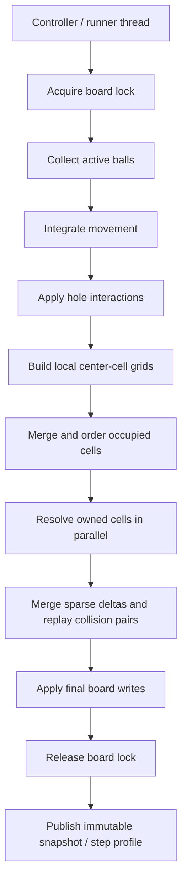
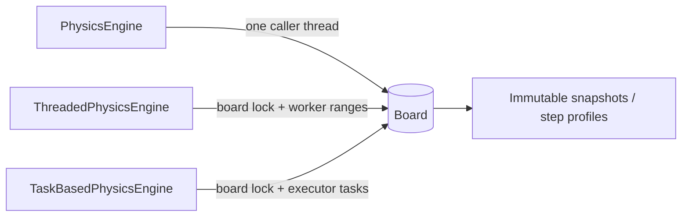

# Physics Engines and Concurrency Design

This document explains the physics layer in `assignment-1` from the point of
view of an oral exam: what each engine owns, what stays shared, which phases
are parallel, and which phases remain serialized.

The goal is not to claim that one engine is always faster. The goal is to make
the design choices easy to justify and to keep the concurrency story readable.

For a more detailed tick-by-tick audit, including the exact Amdahl bottlenecks
and synchronization points in the current implementation, see:

- `docs/performance/physics-architecture-analysis.md`

## 1. Project Architecture

The physics code is organized around one shared domain model and three
execution policies:

- `pcd.poool.model.physics.common`
  shared entities, board state, and the `PhysicsStepper` abstraction;
- `pcd.poool.model.physics.sequential`
  the sequential reference stepper;
- `pcd.poool.model.physics.threaded`
  the platform-thread engine with long-lived workers;
- `pcd.poool.model.physics.taskbased`
  the executor-based engine with per-phase task submission.

The important separation is:

- the board owns the mutable physical state;
- the physics stepper decides how one tick is computed;
- the game model consumes the resulting events and applies game rules;
- immutable snapshots are published to the view and tests.

## 2. Physics Tick Pipeline

Every engine follows the same high-level tick structure, even if the internal
parallelization differs.

The serialized points are intentional:

- the board lock prevents two writers from mutating the same state at once;
- ordering keeps collision resolution deterministic;
- the final merge/application phase commits one tick result at a time.

## 3. `PhysicsStepper`

`PhysicsStepper` is the seam between the domain model and the execution
strategy.

It is intentionally small:

- input: a mutable `Board` and elapsed time;
- output: no direct return value, because the board itself is the mutable
  result of the step.

That gives us one shared contract for:

- `PhysicsEngine`
- `ThreadedPhysicsEngine`
- `TaskBasedPhysicsEngine`

The abstraction matters because the rest of the game should not care whether a
tick is computed by one thread, by long-lived workers, or by executor tasks.

## 4. Sequential Engine

`pcd.poool.model.physics.sequential.PhysicsEngine` is the baseline engine.

Its behavior is simple:

- it synchronizes on the board for the whole tick;
- it splits large elapsed times into bounded sub-steps;
- each sub-step integrates movement, applies holes, and resolves collisions on
  the caller thread;
- candidate collisions are produced and consumed in one deterministic pass.

This engine is the reference semantics for the other implementations. It is
also the easiest engine to explain because there is no intra-tick concurrency.

Tradeoff:

- simplest control flow;
- strongest determinism;
- least parallelism.

## 5. Platform-Thread Engine

`pcd.poool.model.physics.threaded.ThreadedPhysicsEngine` keeps the board as a
single-writer object, but it parallelizes internal phases with long-lived
worker threads.

The worker lifecycle is:

1. create workers once in the engine constructor;
2. assign disjoint ranges for one phase;
3. wait on a completion monitor;
4. reuse the same workers for the next phase;
5. close all workers when the engine is closed.

### 5.1 Parallel phases

The threaded engine parallelizes:

- ball integration over contiguous ranges;
- local center-cell grid construction;
- ordered cell resolution for owned cells;
- sparse collision contribution computation;
- final delta application when enough balls were touched.

### 5.2 Serialized phases

The following steps remain serialized:

- board ownership and tick entry;
- hole application;
- local-grid merge;
- deterministic cell ordering;
- collision-event recording;
- result publication.

### 5.3 Shared state and immutable snapshots

Workers never mutate the board structure directly. They only:

- read the tick-start state;
- write to private per-worker accumulators;
- return results to the controller thread.

The controller then performs the merge/application phase:

- sparse deltas are merged on the coordinator;
- collision pairs are replayed in stable encoded-index order;
- the final board writes happen in a controlled phase.

That means the mutable shared state stays centralized, while the parallel work
is limited to computation over disjoint ranges or private buffers.

### 5.4 Why synchronization is safe

The safety story is deliberately coarse-grained:

- one monitor on the board protects the authoritative tick;
- one completion monitor waits for worker phase completion;
- each worker has a single mutable task slot;
- `while` loops guard all waits, so spurious wakeups do not break the barrier.

This is simpler to reason about than fine-grained locks on individual balls or
spatial regions.

Tradeoff:

- less coordination overhead than a per-ball lock design would have;
- more merge work than a fully sequential solver;
- deterministic order is preserved only because the merge and apply phases are
  explicitly serialized.

## 6. Executor-Based Engine

`pcd.poool.model.physics.taskbased.TaskBasedPhysicsEngine` uses an
`ExecutorService` instead of manually managed workers.

It keeps the same ownership rule:

- the caller owns the board lock for the whole tick;
- tasks only operate on disjoint ranges or private accumulation buffers;
- the coordinator thread merges and applies the results.

### 6.1 Task partitioning

The task-based engine prefers range partitioning:

- one task gets one contiguous index interval;
- the interval is computed from the current workload size and pool size;
- tiny phases may stay serial when task overhead would dominate the work.

That choice keeps task creation predictable and avoids scattering a single
logical phase across too many tiny jobs.

### 6.2 Staged collision pipeline

The current task-based engine follows the same staged collision pipeline as
the threaded engine:

- build private center-cell grids per task;
- merge the local grids into one deterministic ordered view;
- resolve owned cells in parallel over contiguous cell ranges;
- accumulate sparse collision deltas and packed collision pairs locally;
- merge the sparse results on the coordinator thread;
- replay the recorded collision pairs in deterministic order;
- apply the final merged deltas to the authoritative board.

There is also a helper for building collision rounds from a pair list, but it
is supporting code rather than the live tick path.

### 6.3 Shutdown and cancellation behavior

The executor is shut down gracefully:

- `close()` prevents new steps from being accepted;
- already-submitted tasks can finish their current work;
- interruption during future waiting is converted into a controlled failure;
- the caller is not left with dangling worker ownership.

This is a lifecycle choice, not just an implementation detail, because the
engine may be used by a long-running game runner.

Tradeoff:

- simpler worker management than hand-written thread lifecycle;
- more allocation per tick because futures and task objects are recreated;
- the commit rules remain explicit, so the result stays deterministic.

## 7. Comparison Table

| Engine | Parallel unit | Worker ownership | Serialized phases | Best fit | Main tradeoff |
| --- | --- | --- | --- | --- | --- |
| Sequential | none | caller thread | all phases | baseline semantics, debugging | no intra-tick parallelism |
| Threaded | long-lived platform-thread ranges | engine-owned workers | board lock, merge, ordering, final apply | clear worker lifecycle and reusable threads | manual coordination code |
| Task-based | executor tasks over ranges or rounds | executor pool | board lock, merge, ordering, final apply | simpler pool management and flexible scheduling | more task/future allocation |

## 8. Immutable Snapshots and Produced Results

The physics engines do not directly feed the GUI mutable board objects.

Instead, the runtime publishes immutable or copy-based results:

- `GameSnapshot` and `RuntimeGameSnapshot` for match-level state;
- `Board.BallSnapshot` for render-friendly ball state;
- `Board.HoleInteractions` for hole results gathered by the task-based
  coordinator;
- `ThreadedPhysicsEngine.StepProfile` and `TaskBasedPhysicsEngine.StepProfile`
  for profiling and benchmark inspection.

These results make it possible to separate:

- mutable simulation state;
- immutable view state;
- diagnostic measurements.

## 9. Engine Comparison Diagram

The diagram highlights a useful exam sentence: the engines differ in
execution policy, but they all target the same board contract and produce the
same kind of observable results.

## 10. Known Bottlenecks and Tradeoffs

The main costs are not hidden:

- synchronized access to `Board` and `GameModel` serializes authoritative
  updates;
- snapshot creation copies state for safety;
- collision detection still has merge steps because candidate pairs must be
  ordered deterministically;
- small workloads may not benefit from concurrency because coordination
  overhead can dominate useful work;
- dense collision regions reduce the usefulness of spatial partitioning.

These are not bugs by themselves. They are the cost of keeping the design
understandable, deterministic, and safe enough to explain at the exam.

## 11. Reading Order for the Exam

If you want a short explanation path, use this order:

1. `PhysicsStepper` as the abstraction boundary.
2. `PhysicsEngine` as the sequential baseline.
3. `ThreadedPhysicsEngine` as the worker-thread version.
4. `TaskBasedPhysicsEngine` as the executor-based version.
5. `GameSnapshot` / `RuntimeGameSnapshot` / `StepProfile` as the immutable
   results that leave the physics layer.
