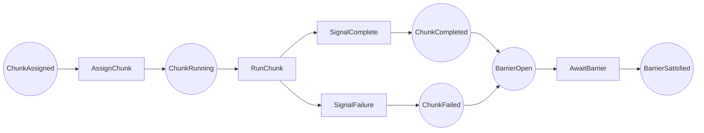

# Assignment 1 Petri Nets for Concurrent Physics Execution

This directory contains LaTeX-ready Petri net diagrams for the concurrent
physics execution model used in Assignment 1.

Sources:

- `assignment-1/docs/verification/petri-nets/physics-tick-petri-net.tex`
- `assignment-1/docs/verification/petri-nets/shot-command-petri-net.tex`

Suggested LaTeX inclusion:

```latex
\begin{figure}[ht]
  \centering
  \input{assignment-1/docs/verification/petri-nets/physics-tick-petri-net.tex}
  \caption{Abstract Petri net for the concurrent physics tick pipeline.}
\end{figure}
```

TODO for the final report: include the generated TikZ sources directly from
the document preamble or a local figure wrapper, rather than exporting and
tracking standalone PDF assets.

The main model intentionally stays above low-level ball physics. It focuses on:

- phase ordering;
- worker coordination;
- barriers and completion monitors;
- single-writer ownership of mutable state;
- snapshot publication;
- deadlock avoidance under normal execution.

The same abstract net describes both runtime variants:

- the platform-thread implementation in `pcd.poool.model.physics.threaded`;
- the executor-based implementation in `pcd.poool.model.physics.taskbased`.

## 1. Modeling conventions

The net uses the usual Petri net interpretation:

- places hold tokens;
- transitions consume and produce tokens;
- tokens represent permissions, phase ownership, or completion signals;
- a transition may fire only when all its input places contain the required
  tokens.

In this model, tokens do not represent ball data. They represent control over
the tick pipeline.

### 1.1 Core places

- `TickReady`
  controller may start a new tick.
- `BoardWriteOwned`
  the controller owns the authoritative board state for this tick.
- `CommandsPending`
  queued external commands are waiting to be drained.
- `IntegrationWorkReady`
  a batch of disjoint integration tasks is ready.
- `IntegrationDone`
  all integration tasks for the batch have completed.
- `HolePhaseReady`
  hole interactions may be applied.
- `LocalGridReady`
  the worker set can build private local center-cell grids.
- `OrderedCellsReady`
  the coordinator has merged the local grids into one ordered occupied-cell
  view.
- `SparseDeltasReady`
  collision-resolution contributions have been accumulated in sparse form.
- `CommitReady`
  the board is in a consistent post-tick state and can be committed.
- `SnapshotPublishReady`
  the board is in a consistent post-tick state and can be published.
- `SnapshotPublished`
  an immutable snapshot has been stored for the GUI and bot.
- `ShutdownRequested`
  the runtime is stopping.

### 1.2 Core transitions

- `StartTick`
- `DrainCommands`
- `DispatchIntegration`
- `JoinIntegration`
- `ApplyHoleInteractions`
- `BuildLocalGrid`
- `MergeGrids`
- `ResolveOwnedCells`
- `MergeDeltas`
- `PublishSnapshot`
- `FinishTick`

## 2. Abstract tick net

The following diagram models one complete physics tick.

```mermaid
flowchart LR
    TickReady((TickReady\n1 token))
    BoardWriteOwned((BoardWriteOwned\n1 token))
    CommandsPending((CommandsPending\n0..n tokens))
    IntegrationWorkReady((IntegrationWorkReady\n1 token))
    IntegrationDone((IntegrationDone\n1 token))
    HolePhaseReady((HolePhaseReady\n1 token))
    LocalGridReady((LocalGridReady\n1 token))
    OrderedCellsReady((OrderedCellsReady\n1 token))
    SparseDeltasReady((SparseDeltasReady\n1 token))
    CommitReady((CommitReady\n1 token))
    SnapshotPublishReady((SnapshotPublishReady\n1 token))
    SnapshotPublished((SnapshotPublished\n1 token))

    StartTick[StartTick]
    DrainCommands[DrainCommands]
    DispatchIntegration[DispatchIntegration]
    JoinIntegration[JoinIntegration]
    ApplyHoleInteractions[ApplyHoleInteractions]
    BuildLocalGrid[BuildLocalGrid]
    MergeGrids[MergeGrids]
    ResolveOwnedCells[ResolveOwnedCells]
    MergeDeltas[MergeDeltas]
    PublishSnapshot[PublishSnapshot]
    FinishTick[FinishTick]

    TickReady --> StartTick
    StartTick --> BoardWriteOwned
    BoardWriteOwned --> DrainCommands
    CommandsPending --> DrainCommands
    DrainCommands --> IntegrationWorkReady

    IntegrationWorkReady --> DispatchIntegration
    DispatchIntegration --> JoinIntegration
    JoinIntegration --> IntegrationDone

    IntegrationDone --> ApplyHoleInteractions
    ApplyHoleInteractions --> HolePhaseReady
    HolePhaseReady --> BuildLocalGrid

    BuildLocalGrid --> MergeGrids
    MergeGrids --> OrderedCellsReady
    OrderedCellsReady --> ResolveOwnedCells

    ResolveOwnedCells --> MergeDeltas
    MergeDeltas --> CommitReady
    CommitReady --> PublishSnapshot

    PublishSnapshot --> SnapshotPublishReady
    SnapshotPublishReady --> FinishTick
    FinishTick --> SnapshotPublished
    SnapshotPublished --> TickReady
```



### 2.1 Meaning of the places

- `TickReady` means the controller may begin the next tick.
- `BoardWriteOwned` means exactly one controller owns the authoritative board
  mutation for the whole tick.
- `IntegrationWorkReady` means the worker batch for kinematic integration has
  been created.
- `IntegrationDone` means all integration tasks have returned.
- `HolePhaseReady` means pocketing and hole effects may be applied after
  movement.
- `LocalGridReady` means workers may build private local cell grids from a
  stable tick-start view.
- `OrderedCellsReady` means the coordinator has merged the local grids into a
  deterministic occupied-cell view.
- `SparseDeltasReady` means the collision-resolution contributions have been
  computed and staged for merge.
- `CommitReady` means all sparse collision contributions for the tick have
  been merged and the board can be committed.
- `SnapshotPublishReady` means the board has reached a consistent commit
  point.
- `SnapshotPublished` means the immutable state is now visible to the GUI and
  bot.

### 2.2 Meaning of the transitions

- `StartTick` acquires the tick token and begins a new controller-owned cycle.
- `DrainCommands` serializes pending input and bot requests before physics
  starts.
- `DispatchIntegration` assigns disjoint ball ranges to workers.
- `JoinIntegration` acts as the phase barrier for integration.
- `ApplyHoleInteractions` performs the serialized hole/pocketing phase.
- `BuildLocalGrid` assigns the local-grid construction work for each worker.
- `MergeGrids` waits for the local-grid barrier and combines the private
  grids.
- `ResolveOwnedCells` assigns collision-resolution work on the merged ordered
  cell view.
- `MergeDeltas` waits for the collision-resolution barrier and merges the
  sparse deltas.
- `PublishSnapshot` stores an immutable snapshot for readers.
- `FinishTick` releases the controller back to `TickReady`.

## 3. Worker sub-net

The worker sub-net makes the barrier structure explicit. Each worker chunk has
its own local completion path.



This subnet is reusable for all worker phases:

- integration;
- local grid construction;
- ordered-cell collision resolution and sparse delta merging;
- parallel final apply of disjoint ball ranges.

## 4. Mapping to implementation classes

### 4.1 Threaded implementation

| Petri net element | Implementation mapping |
| --- | --- |
| `TickReady`, `StartTick`, `FinishTick` | `pcd.poool.threaded.ThreadedGameRunner.runController()` |
| `CommandsPending`, `DrainCommands` | `pcd.poool.runtime.CommandQueueMonitorSupport` plus `drainPendingCommands()` |
| `BoardWriteOwned` | `synchronized (board)` inside `pcd.poool.model.physics.threaded.ThreadedPhysicsEngine.stepInternal(...)` |
| `DispatchIntegration`, `BuildLocalGrid`, `ResolveOwnedCells` | `ThreadedPhysicsEngine.runRanges(...)` |
| worker chunk places and transitions | `pcd.poool.model.physics.threaded.PhysicsWorker` |
| barrier places and joins | `pcd.poool.model.physics.threaded.WorkerCompletionMonitor.await()` |
| `PublishSnapshot`, `SnapshotPublished` | `pcd.poool.runtime.SnapshotStoreSupport.publish(...)` and `RuntimeGameSnapshot.from(game)` |
| immutable reader state | `pcd.poool.runtime.RuntimeGameSnapshot` |

The threaded engine uses long-lived platform threads. The controller thread
submits range tasks, waits on the completion monitor, merges worker-private
results, applies the final writes, and only then publishes the snapshot.

### 4.2 Executor-based implementation

| Petri net element | Implementation mapping |
| --- | --- |
| `TickReady`, `StartTick`, `FinishTick` | `pcd.poool.taskbased.TaskBasedGameRunner.tick()` |
| `CommandsPending`, `DrainCommands` | `pcd.poool.runtime.CommandQueueMonitorSupport` plus `drainPendingCommands()` |
| `BoardWriteOwned` | `synchronized (board)` inside `pcd.poool.model.physics.taskbased.TaskBasedPhysicsEngine.stepInternal(...)` |
| `DispatchIntegration`, `BuildLocalGrid`, `ResolveOwnedCells` | `TaskBasedPhysicsEngine.runRanges(...)` and executor tasks |
| worker chunk places and transitions | fixed `ExecutorService` workers inside `TaskBasedPhysicsEngine` |
| barrier places and joins | `Future` joins and internal task aggregation in `TaskBasedPhysicsEngine` |
| `PublishSnapshot`, `SnapshotPublished` | `pcd.poool.runtime.SnapshotStoreSupport.publish(...)` and `RuntimeGameSnapshot.from(game)` |
| immutable reader state | `pcd.poool.runtime.RuntimeGameSnapshot` |

The executor-based engine keeps the same ownership discipline as the threaded
one. The difference is only the worker vehicle: a fixed executor pool instead
of manually owned platform threads.

## 5. Phase-to-code traceability

The abstract tick pipeline maps onto the following concrete methods:

- integration phase:
  - `ThreadedPhysicsEngine.stepOnce(...)`
  - `TaskBasedPhysicsEngine.stepOnce(...)`
- hole phase:
  - `board.applyHoleInteractions()`
- local-grid phase:
  - `ThreadedPhysicsEngine.stepInternal(...)`
  - `TaskBasedPhysicsEngine.stepInternal(...)`
- ordered-cell resolution phase:
  - `resolveOwnedCell(...)`
  - `collectPairsWithinBag(...)`
  - `collectCrossPairs(...)`
- snapshot publication:
  - `ThreadedGameRunner.runController()`
  - `TaskBasedGameRunner.tick()`
  - `RuntimeGameSnapshot.from(game)`

## 6. Safety properties

### 6.1 Phase ordering

The net enforces the following order:

1. drain commands;
2. integrate movement;
3. apply hole interactions;
4. build local grids;
5. merge local grids and resolve ordered cells;
6. merge sparse collision deltas;
7. publish a snapshot.

The collision transitions are not enabled until the integration and hole
phases have completed. That prevents the model from resolving contacts against
half-updated positions.

### 6.2 No concurrent cross-cell mutation

The authoritative board is protected by a single writer token for the full
tick.

Workers never mutate shared board state directly during the broad phase or the
collision-resolution phase. They only:

- read the stable tick-start state;
- write to private accumulators;
- return completion signals.

The final write-back is serialized by the controller, so two workers cannot
concurrently update the same authoritative ball state.

### 6.3 No premature collision phase

Collision resolution is not enabled until the integration phase and the hole
phase have both completed. This excludes the unsafe case where a worker would
resolve collisions against balls that are still moving or have not yet been
removed by pocketing.

### 6.4 Snapshot visibility

The snapshot transition occurs only after all state mutations for the tick have
completed. The GUI therefore sees a consistent post-tick state, not a partially
updated board.

## 7. Liveness properties

The liveness claims below assume normal execution, meaning:

- workers are scheduled;
- no worker throws an unrecoverable failure;
- shutdown is not requested mid-tick;
- the board state is finite.

### 7.1 Workers eventually complete their phases

Each worker chunk is finite and assigned to a bounded range of balls or cells.
Once the worker starts, it can eventually reach its completion place because
the task does not wait for another worker while holding a worker-local lock.

### 7.2 The tick eventually completes

After all worker chunks complete, the barrier transition fires, the coordinator
merges the partial results, and snapshot publication becomes enabled. The tick
therefore cannot remain stuck in a mid-phase state under normal execution.

### 7.3 No deadlock in normal execution

The design avoids the classic deadlock pattern of "worker waits while holding
the board lock" because:

- the board lock is acquired once per tick by the controller;
- workers operate on private ranges or private accumulators;
- barrier waits are separate from board mutation;
- shutdown wakes blocked waiters instead of leaving them parked forever.

The monitor code also uses `while` loops around `wait()`, which prevents
spurious wakeups from breaking the synchronization protocol.

## 8. How to read the model in the report

The simplest reading is:

- one controller token owns the tick;
- worker tokens represent parallelizable subranges;
- barrier transitions collect worker completions;
- the controller alone commits the tick;
- the snapshot token releases the GUI view of the new state.

That abstraction is detailed enough to justify correctness claims, but still
small enough to stay readable in the report.
