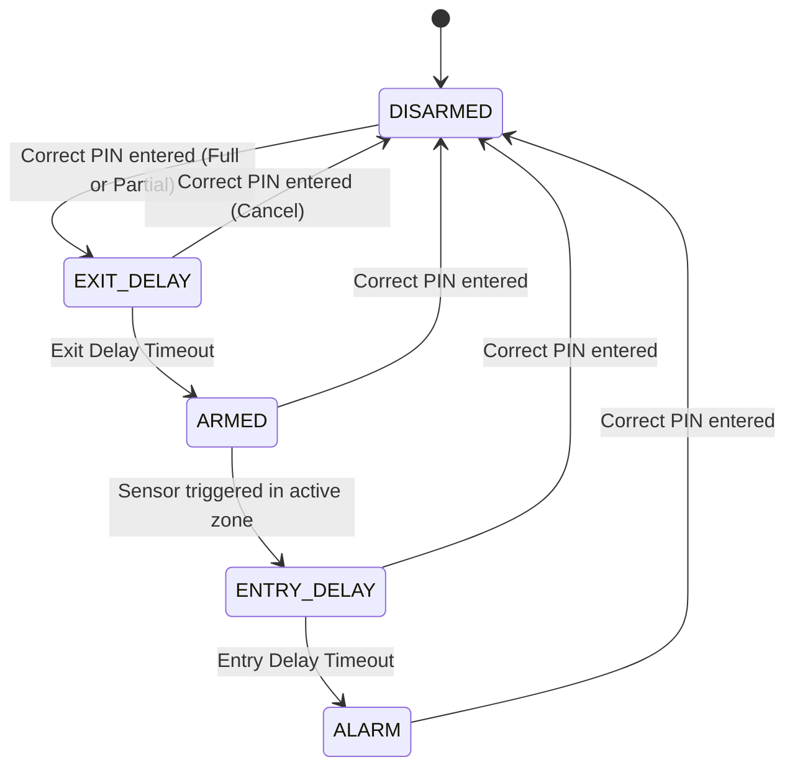

PCD a.y. 2025-2026 - ISI LM UNIBO - Cesena Campus

# Assignment #03 `

v1.0.0-20260504

The assignment is about concurrent programming based on message passing, synchronous message passing based on processes and channels (first exercise, in Go) and asynchronous message passing based on actors (second exercise, using Apache Pekko).


### Exercise #1 - *Smart Home Alarm System* 

- [Description](https://github.com/nicolasfara/seminar-pcd-actor-pekko-code/blob/master/assignment_3_smart_home_alarm.md) by N. Farabegoli
- [Description local file](assignment_3_smart_home_alarm.md)
- **Implementation Status:** Completed using **Apache Pekko** (Typed Actor model) in Java, including the **Bonus part** (Zone-Based Control and Partial Arming).

#### Key Components and Architecture
The system consists of the following typed actors under package `pcd.shas`:
1. [ControlUnitActor](src/main/java/pcd/shas/controlunit/ControlUnitActor.java): The central FSM controller. It maintains the current state (Disarmed, Exit Delay, Armed, Entry Delay, Alarm) and active zones.
2. [KeypadActor](src/main/java/pcd/shas/keypad/KeypadActor.java): Accumulates keypad character entries (`0-9`), supports clearing (`*`), submitting (`#`), and zone selection/deselection for partial arming.
3. [SensorActor](src/main/java/pcd/shas/sensor/SensorActor.java): Simulates peripheral sensors (motion detectors and door/window sensors) assigned to specific zones.
4. [SirenActor](src/main/java/pcd/shas/siren/SirenActor.java): Simulates the alarm siren.

#### FSM State Transitions


#### Build and Execution Commands
- **Compile:**
  ```bash
  mvn -f assignment-3/pom.xml compile
  ```
- **Run Tests:**
  ```bash
  mvn -f assignment-3/pom.xml test
  ```
- **Run Simulator (Interactive CLI):**
  ```bash
  mvn -f assignment-3/pom.xml exec:java -Dexec.mainClass="pcd.shas.Main"
  ```


### Exercise #2 - *Heads-or-Tails Championship*

The goal of the exercise is to design and implement in Go language a championship of `N` players playing a `Heads-or-Tails` game. The number of players `N` is equal to 2<sup>`m`</sup>, so that  the championship is organized in `m` rounds: at each round, games run concurrently and the winners goes to the next round, until the final round. For instance: with `m = 3`, we have 8 players, at the first round playing 4 games concurently; the 4 winners go on playing the next round, playing 2 games concurrently (i.e. the semi-finals); finally, the 2 winners play the final game and we have a winner. 
- To be implemented in Go using an interaction model based on message passing
  - no shared memory is allowed
- **Implementation path**: [assignment-3/src/main/go/pcd/hotc](file:///home/francesco/Documents/PCD-26/assignment-3/src/main/go/pcd/hotc)
  - Run the program: `go run . -m <rounds>` (inside the implementation directory) or using the root scripts:
    - **Bash**: `./run-hotc.sh [-m <rounds>]`
    - **PowerShell**: `.\run-hotc.ps1 [-m <rounds>]`
  - Run tests: `go test -v ./...` (inside the implementation directory) or using the root scripts:
    - **Bash**: `./test-hotc.sh`
    - **PowerShell**: `.\test-hotc.ps1`


### The deliverable

The deliverable must be a zipped folder `Assignment-03`, to be submitted on the course web site, including:  
- `src` directory with sources
- `doc` directory with a short report in PDF (`report.pdf`). The report should include:
	- A brief analsysis of the problem, focusing in particular aspects that are relevant from a  concurrent point of view.
	- A brief description of the strategy adopted

