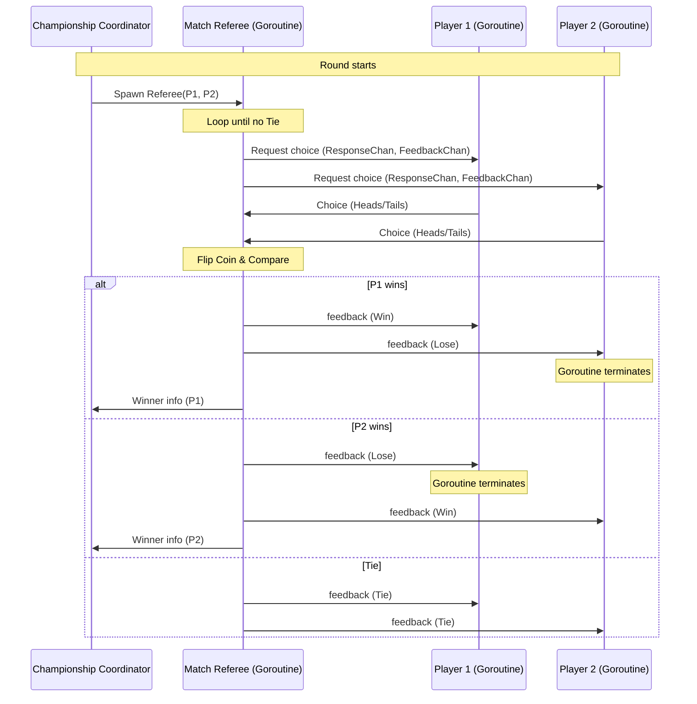

# Heads-or-Tails Championship (Go)

This project is the implementation of **Exercise 2** for **Assignment 3** of the Concurrent and Distributed Programming course (PCD).

It models a tournament of $N = 2^m$ players playing concurrent matches of Heads-or-Tails, transitioning through $m$ rounds until a single champion is crowned.

## Concurrency & Message Passing Design

The implementation adheres to a strict **message-passing model** without any shared memory, using Go's processes (goroutines) and channels for interaction.



### Components

1. **Players (`player.go`)**:
   - Each player runs in its own goroutine.
   - It listens on its private request channel `ReqChan` for a `Request` from a referee.
   - For each request, it generates a random choice (`Heads` or `Tails`), sends it over the provided `ResponseChan`, and awaits the outcome on `FeedbackChan`.
   - If the player receives `Lose`, it prints its elimination and naturally terminates.
   - If it receives `Win` or `Tie`, it remains active and waits for future requests.

2. **Match Referees (`referee.go`)**:
   - Spawned by the coordinator for each individual match.
   - Coordinates the game between two players by sending them requests, receiving their choices, and flipping a coin.
   - Handles tie-breaker matches automatically and concurrently by repeating the choice request loop until a winner is determined.
   - Notifies the winner and the loser, then sends the winner's info to the coordinator via the `winnerChan`.

3. **Championship Coordinator (`championship.go`)**:
   - Spawns $N = 2^m$ player goroutines.
   - Coordinates the $m$ rounds.
   - For each round, pairs active players and spawns referees concurrently.
   - Uses the buffered channel `winnerChan` to block and collect the winners of all games, serving as a clean concurrent barrier.
   - At the end of the tournament, closes the champion's `ReqChan`, causing the champion goroutine to exit cleanly.
   - Uses a `sync.WaitGroup` to wait for all player goroutines to exit before finishing.

## Folder Directory Structure

- [go.mod](go.mod): Go module declaration.
- [main.go](main.go): CLI entry point for the simulation (package `main`).
- [championship/](championship): Main package containing the core tournament logic (package `championship`).
  - [championship/types.go](championship/types.go): Defines `Choice`, `GameResult`, `Request`, and `PlayerInfo`.
  - [championship/player.go](championship/player.go): Main event loop for player goroutines.
  - [championship/referee.go](championship/referee.go): Coordination logic for single matches.
  - [championship/championship.go](championship/championship.go): Main tournament controller.
  - [championship/championship_test.go](championship/championship_test.go): Focused test cases.

## How to Build & Run

### Prerequisites

- Go 1.22 or higher installed.

### Run the Simulation

Navigate to the package folder:
```bash
cd assignment-3/src/main/go/pcd/hotc
```

Run with default arguments ($m = 3$ rounds, $8$ players):
```bash
go run .
```

Run with custom number of rounds, e.g., $m = 4$ ($16$ players):
```bash
go run . -m 4
```

### Run Tests

Run the test suite to verify implementation correctness:
```bash
go test -v ./...
```
