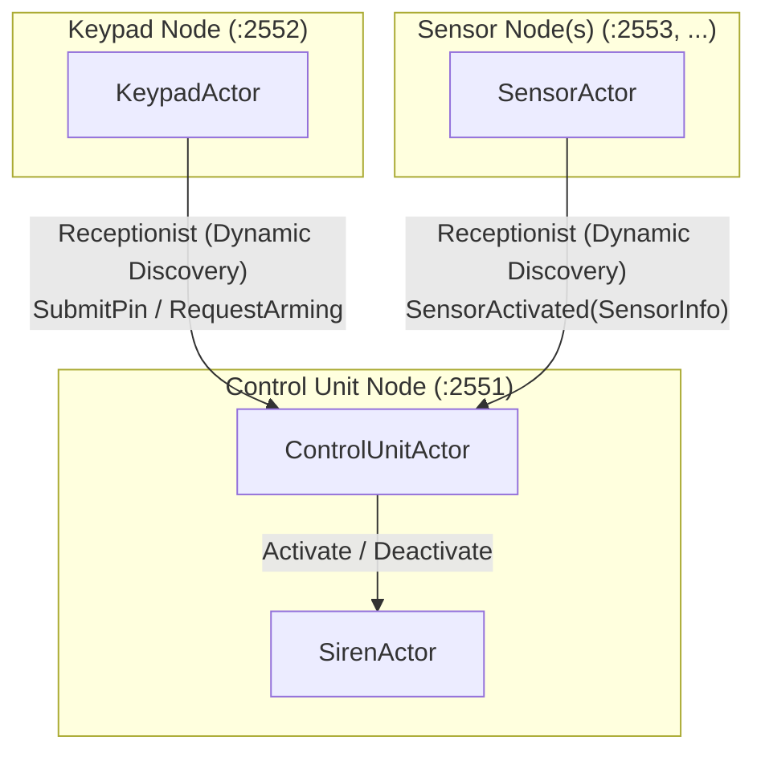
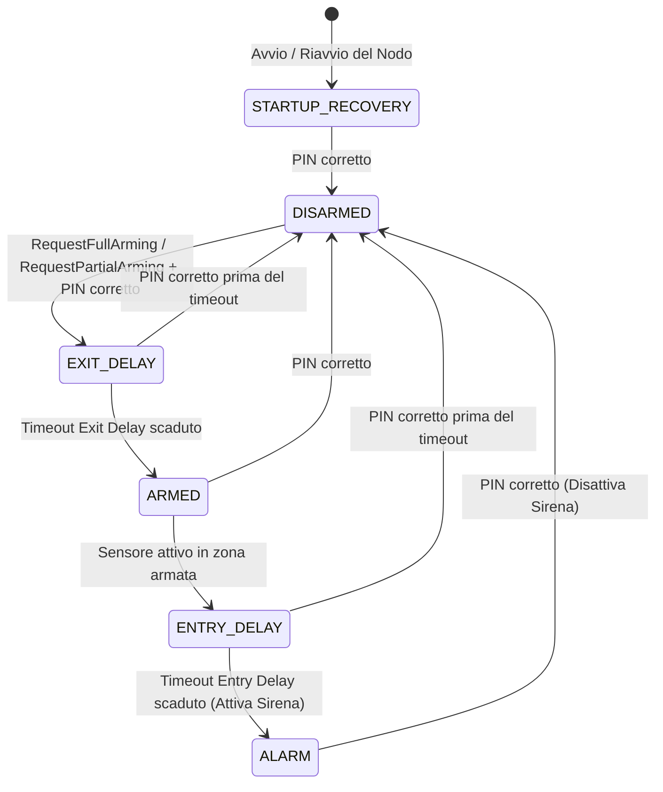

# Clustered Smart Home Alarm System (CSHAS) - Guida Completa all'Architettura e a Pekko Cluster

Questa guida raccoglie l'analisi dettagliata del funzionamento del progetto **Clustered Smart Home Alarm System**, i concetti chiave di **Apache Pekko Clustered** e un **percorso di studio consigliato**.

---

## 1. Architettura del Progetto

Il progetto implementa un sistema di allarme distribuito basato su **Apache Pekko Typed (Java DSL)**. A differenza di un sistema su singolo nodo locale, i componenti dell'impianto (centralina, tastierino, sensori e sirena) sono eseguiti come nodi autonomi all'interno di un cluster Pekko e comunicano esclusivamente mediante scambio di messaggi tipizzati asincroni.

### 1.1 I Ruoli dei Nodi nel Cluster

La topologia a runtime si articola su tre ruoli principali:



1. **`control-unit` (`pcd.shas.controlunit.ControlUnitActor`)**:
   - È il componente centrale dell'allarme. Mantiene e coordina la Macchina a Stati Finiti (FSM).
   - Registra il proprio `ActorRef` sul **Receptionist** distribuito di Pekko tramite la chiave di servizio `CONTROL_UNIT_SERVICE_KEY`.
   - Gestisce i timer di ingresso ed uscita tramite `TimerScheduler`.
   - Sottoscrive il servizio sirena (`SIREN_SERVICE_KEY`) e comanda la `SirenActor`.
2. **`keypad` (`pcd.shas.keypad.KeypadActor`)**:
   - Modella il tastierino fisico di controllo. Bufferizza le cifre digitate dall'utente (`*` per resettare, `#` per confermare) o riceve comandi diretti da console/script.
   - Non memorizza l'indirizzo IP della centralina: si iscrive al `Receptionist` e riceve dinamicamente l'aggiornamento quando una centralina si unisce al cluster.
   - Inoltra le richieste di inserimento (`RequestFullArming`, `RequestPartialArming`) o disinserimento (`PinSubmitted`).
3. **`sensor` (`pcd.shas.sensor.SensorActor`)**:
   - Rappresenta un sensore distribuito, dotato di identificativo univoco (`sensorId`), tipologia (`SensorType`: `DOOR_WINDOW`, `MOTION`) e zona di installazione (`Zone`: `PERIMETER`, `GROUND_FLOOR`, `LIVING_AREA`, `SLEEPING_AREA`).
   - All'attivazione invia alla centralina scoperta tramite `Receptionist` un messaggio contenente `SensorInfo` e timestamp dell'evento.
4. **`siren` (`pcd.shas.siren.SirenActor`)**:
   - Attore locale al nodo di controllo che gestisce i due stati mutuamente esclusivi `silent` e `active`. Si registra anch'esso al `Receptionist`.

---

### 1.2 Macchina a Stati Finiti (FSM) della Centralina

La logica della centralina è implementata in `ControlUnitActor` attraverso metodi funzionali che restituiscono un nuovo `Behavior<Command>` a ogni transizione di stato:



#### Descrizione degli Stati:
- **`STARTUP_RECOVERY`**:
  - Stato di sicurezza in cui il sistema entra all'avvio iniziale (*cold boot*) o a seguito di un crash e riavvio del nodo centralina.
  - Tutti i sensori vengono ignorati e le richieste di armamento respinte.
  - È necessario immettere il PIN corretto per validare lo stato e passare a `DISARMED`.
- **`DISARMED`**:
  - Sistema a riposo: le attivazioni dei sensori vengono registrate nei log ma non fanno scattare allarmi.
  - L'utente può richiedere l'armamento totale (`RequestFullArming`) o parziale (`RequestPartialArming`) specificando le zone e il PIN corretto.
- **`EXIT_DELAY`**:
  - Avvia un timer di uscita (es. 5 secondi). Permette agli occupanti di lasciare l'abitazione senza attivare l'allarme.
  - L'immissione del PIN corretto in questa finestra annulla l'armamento e ritorna in `DISARMED`.
- **`ARMED`**:
  - Sistema armato per le zone specificate.
  - Se un sensore di una zona attiva rileva una presenza/apertura, il sistema passa in `ENTRY_DELAY`. Sensori appartenenti a zone disattivate vengono ignorati.
- **`ENTRY_DELAY`**:
  - Avvia un timer di ingresso (es. 5 secondi) per consentire a chi rientra di digitare il PIN di sblocco.
  - Se il PIN corretto viene inserito prima dello scadere del timer, il sistema torna in `DISARMED`. Se il timer scade, scatta l'allarme.
- **`ALARM`**:
  - La sirena (`SirenActor`) viene attivata.
  - L'unica transizione possibile è l'immissione del PIN corretto, che spegne la sirena e riporta il sistema in `DISARMED`.

---

### 1.3 Scoperta Dinamica e Comunicazione di Rete

- **Dynamic Discovery via `Receptionist`**:
  - Invece di configurare indirizzi fisici statici, gli attori usano il registro distribuito `Receptionist` integrato in Pekko Typed.
  - `ControlUnitActor` pubblica se stesso con `CONTROL_UNIT_SERVICE_KEY`.
  - `KeypadActor` e `SensorActor` si iscrivono alle notifiche con `Receptionist.subscribe(...)`. Pekko propaga i riferimenti via protocollo gossip a tutti i nodi.
- **Serializzazione dei Messaggi con Jackson JSON**:
  - Tutti i messaggi scambiati su rete remota implementano l'interfaccia marker `pcd.shas.common.MySerializable`.
  - In `application.conf` è configurato il binding:
    ```hocon
    pekko.actor.serialization-bindings {
      "pcd.shas.common.MySerializable" = jackson-json
    }
    ```

---

## 2. Come funziona in generale Apache Pekko Cluster

Apache Pekko è un framework per la costruzione di applicazioni concorrenti, distribuite e resilienti basato sul **Modello ad Attori**:

1. **Attori e Mailbox**:
   - Gli attori comunicano solo inviandosi messaggi asincroni immutabili.
   - Ogni attore possiede una propria *mailbox* (coda di messaggi) che elabora in modo strettamente sequenziale (nessuna condivisione di memoria e nessun lock esplicito).
2. **Location Transparency (Trasparenza di locazione)**:
   - La sintassi per inviare un messaggio (`actorRef.tell(msg)`) è identica sia che il destinatario si trovi nello stesso nodo, su un altro nodo del cluster o su un'altra macchina raggiungibile in rete.

### Concetti Fondamentali di Pekko Cluster:

1. **Nodi e Membri**:
   - Un nodo del cluster è un'istanza di `ActorSystem` configurata con il modulo di rete **Artery** (trasporto TCP/Aeron ad alte prestazioni).
   - Un nodo è identificato da un URI: `pekko://<ClusterName>@<host>:<port>`.
2. **Seed Nodes e Join del Cluster**:
   - Per avviare un cluster distribuito occorre definire uno o più nodi di contatto iniziali (*seed nodes*).
   - I nuovi nodi contattano i seed nodes per effettuare la procedura di `Join` ed entrare nell'anello di nodi.
3. **Protocollo Gossip & Failure Detector**:
   - I nodi si scambiano continuamente informazioni sullo stato del cluster tramite un protocollo di *gossip* con messaggi di heartbeat.
   - Viene utilizzato il **Phi Accrual Failure Detector**: un algoritmo probabilistico che monitora i ritardi degli heartbeat per rilevare nodi disconnessi o non raggiungibili (*Unreachable*).
4. **Ciclo di Vita di un Nodo**:
   - `Joining` $\rightarrow$ `Up` $\rightarrow$ `Leaving` $\rightarrow$ `Exiting` $\rightarrow$ `Down` $\rightarrow$ `Removed`.
5. **Split-Brain Resolver (SBR)**:
   - In presenza di partizioni di rete (es. disconnessione tra sotto-reti), il cluster potrebbe dividersi in due gruppi disgiunti (*split brain*).
   - L'SBR interviene abbattendo in modo deterministico la minoranza dei nodi per garantire la consistenza dello stato distribuito.

---

## 3. Guida allo Studio del Codice (Roadmap)

Per studiare efficacemente il progetto, si consiglia di procedere nel seguente ordine:

### Step 1: Modello Dati e Messaggi Comuni
Esamina il package `pcd.shas.common`:
- `AlarmState.java`: L'enum degli stati (`STARTUP_RECOVERY`, `DISARMED`, `EXIT_DELAY`, `ARMED`, `ENTRY_DELAY`, `ALARM`).
- `Zone.java` e `SensorType.java`: Tipologie e zone di installazione.
- `SensorInfo.java`: Record con i metadati dei sensori inviati alla centralina.
- `MySerializable.java`: Marker interface per Jackson JSON.

### Step 2: La Macchina a Stati (`ControlUnitActor`)
Esamina `pcd.shas.controlunit.ControlUnitActor`:
- I comandi pubblici accettati (`PinSubmitted`, `RequestFullArming`, `RequestPartialArming`, `SensorActivated`, `QueryState`).
- Come la factory `create(...)` registra l'attore sul `Receptionist` e avvia `startupRecovery(alarm)`.
- I singoli metodi di stato (`startupRecovery`, `disarmed`, `exitDelay`, `armed`, `entryDelay`, `alarmTriggered`) e la gestione dei timer (`TimerScheduler`).

### Step 3: Attori Periferici
- `pcd.shas.siren.SirenActor`: Attore a due stati (`silent` e `active`).
- `pcd.shas.keypad.KeypadActor`: Gestione del buffer tasti e inoltro messaggi tramite `Receptionist.subscribe`.
- `pcd.shas.sensor.SensorActor`: Rilevamento evento e invio di `SensorActivated`.

### Step 4: Configurazione e Bootstrap del Cluster
- `src/main/resources/application.conf`: Configurazione HOCON di Pekko (`artery`, `cluster`, `seed-nodes`, `serialization-bindings`).
- `pcd.shas.runtime.NodeStartup.java`: Parsing dei parametri da riga di comando e generazione della configurazione dinamica per porta/host.
- `pcd.shas.Main.java`: entrypoint per lanciare un singolo nodo interattivo (`control-unit`, `keypad` o `sensor`).
- `pcd.shas.DemoMain.java`: entrypoint della demo distribuita; avvia processi separati per centralina, tastierino e sensore e inoltra comandi alle loro CLI.

### Step 5: Test di Integrazione e Verifica
- `src/test/java/pcd/shas/controlunit/ControlUnitActorTest.java`: Test di unità esaustivi su ogni transizione della FSM con `ActorTestKit`.
- `src/test/java/pcd/shas/ClusteredSystemTest.java`: Test di integrazione su cluster a 3 nodi reali con porte dinamiche, verifica di convergenza, invio messaggi e serializzazione di rete.

---

## 4. Esecuzione del Progetto e dei Test

### Esecuzione dei Test
```powershell
mvn --batch-mode --no-transfer-progress test
```

### Avvio della Demo Distribuita (3 processi separati)
```powershell
.\run-cshas.ps1 demo
```

### Avvio di Nodi Separati su Terminali Multipli
1. **Terminale 1 (Centralina)**:
   ```powershell
   .\run-cshas.ps1 control-unit --host 127.0.0.1 --port 2551 --seed-nodes 127.0.0.1:2551,127.0.0.1:2552,127.0.0.1:2553
   ```
2. **Terminale 2 (Tastierino)**:
   ```powershell
   .\run-cshas.ps1 keypad --host 127.0.0.1 --port 2552 --seed-nodes 127.0.0.1:2551,127.0.0.1:2552,127.0.0.1:2553
   ```
3. **Terminale 3 (Sensore)**:
   ```powershell
   .\run-cshas.ps1 sensor --host 127.0.0.1 --port 2553 --sensor-id front_door --sensor-type DOOR_WINDOW --zone PERIMETER --seed-nodes 127.0.0.1:2551,127.0.0.1:2552,127.0.0.1:2553
   ```
