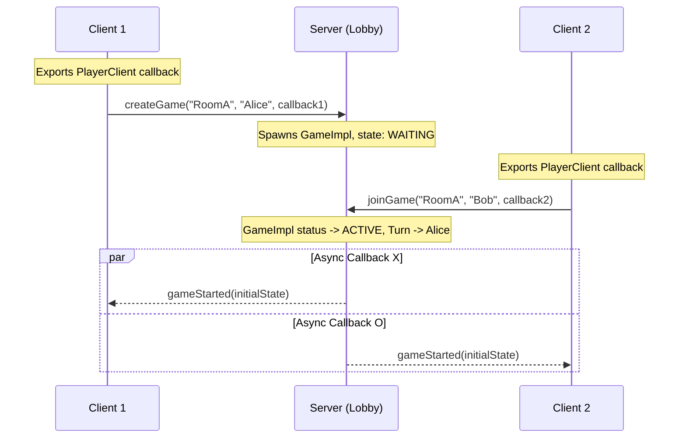

# Distributed Tic-Tac-Toe with Java RMI

A distributed multiplayer Tic-Tac-Toe game built using **Java RMI** as the underlying RPC mechanism. This application supports:
- Programmatic RMI registry setup on the server.
- Multi-client matchmaking via a lobby (list available games, create a game, join a game).
- Dual-mode client interface: a modern slate-colored Swing **GUI** (default) or a fully interactive **CLI** (with automatic fallback on headless environments).
- Real-time updates via RMI **callbacks** (server-to-client notifications).
- High responsiveness and concurrency safety (using Java 21 **virtual threads** for asynchronous callbacks and the **Open Call** pattern).

---

## Architecture & Design Decisions

The application implements a classic distributed client-server model using RMI stubs and callbacks:



### 1. Matchmaking & State Serialization
- **`Lobby`**: The entry point bound to the registry. It hosts the active room map. To prevent memory leaks, completed or abandoned games are pruned from the room list automatically whenever `getWaitingGames` or joins are invoked.
- **`Game`**: Represents a match. It acts as the game controller, validating moves and switching turns.
- **`BoardState`**: An immutable value object representing the grid status, player names, current turn, and match status. It is serialized and pushed to clients.

### 2. Thread Safety & Concurrency
- **Server Safety**: RMI remote invocations run on a thread pool managed by the JVM. All modifications to game/lobby state are fully synchronized.
- **Open Call Pattern**: State transitions are performed inside synchronized blocks, but the actual remote callbacks (notifying players via RMI) are executed *after* releasing the locks. This prevents a slow/hung client from blocking other players or the server lobby, eliminating potential deadlocks.
- **Java 21 Virtual Threads**: Callbacks are dispatched using `Executors.newVirtualThreadPerTaskExecutor()`, providing lightweight, non-blocking asynchronous execution.
- **Client safety (Swing EDT)**: All incoming RMI callback events on the client side are forwarded to the Swing Event Dispatch Thread (EDT) using `SwingUtilities.invokeLater()` to comply with the single-threaded UI rules.

### 3. Connection Issues and Abandonment
- If a client crashes or disconnects, the RMI callback to their stub will throw a `RemoteException`. The server intercepts this, marks the game as `ABANDONED`, and notifies the remaining client.

---

## Project Structure

```text
dttt/
├── pom.xml
├── README.md
└── src
    ├── main/java/pcd/dttt
    │   ├── Main.java              # Unified launcher
    │   ├── common/
    │   │   ├── BoardState.java    # Serializable board snapshot
    │   │   ├── Game.java          # Remote Game interface
    │   │   ├── GameStatus.java    # Enum for match states
    │   │   ├── Lobby.java         # Remote Lobby interface
    │   │   ├── PlayerClient.java  # Remote Client callback interface
    │   │   └── exceptions/        # Domain exception classes
    │   ├── server/
    │   │   ├── GameImpl.java      # Game room RMI implementation
    │   │   ├── LobbyImpl.java     # Lobby RMI implementation
    │   │   └── ServerMain.java    # Server RMI registry host
    │   └── client/
    │       ├── ClientMain.java    # Client CLI/GUI launcher
    │       ├── CLIClient.java     # CommandLine game loop
    │       ├── GUIClient.java     # Swing GUI game loop
    │       ├── GameEventListener.java # Local listener decoupling interface
    │       └── PlayerClientImpl.java  # Client-side callback implementation
    └── test/java/pcd/dttt/server
        ├── GameImplTest.java      # Tic-Tac-Toe rules & state transitions unit tests
        └── LobbyImplTest.java     # Lobby matchmaking and room pruning unit tests
```

---

## Build & Test Instructions

### Compilation and Testing
Run standard Maven command from the `dttt/` directory:
```bash
mvn clean test
```

### Packaging
Package the application into a single runnable JAR (including dependencies):
```bash
mvn package
```
This generates the packaged jar at:
`target/distributed-ttt-1.0-SNAPSHOT-jar-with-dependencies.jar`

---

## How to Run

To run the application, use the dedicated wrapper scripts located in the `dttt/` directory.

### 1. Start the Server
Starts the RMI registry and matchmaker lobby (defaults to port `1099` if not specified):
```bash
./run-dttt-server.sh [port]
```
*(Windows PowerShell: `.\run-dttt-server.ps1 [port]`)*

### 2. Start the Client (GUI Mode)
Launches the GUI client connecting to the lobby (defaults to `localhost` and `1099` if not specified):
```bash
./run-dttt-gui.sh [host] [port]
```
*(Windows PowerShell: `.\run-dttt-gui.ps1 [host] [port]`)*

### 3. Start the Client (CLI Mode)
Launches the CLI client connecting to the lobby (defaults to `localhost` and `1099` if not specified):
```bash
./run-dttt-cli.sh [host] [port]
```
*(Windows PowerShell: `.\run-dttt-cli.ps1 [host] [port]`)*
*Note: If the application detects a headless environment, it will automatically fall back to CLI mode.*
